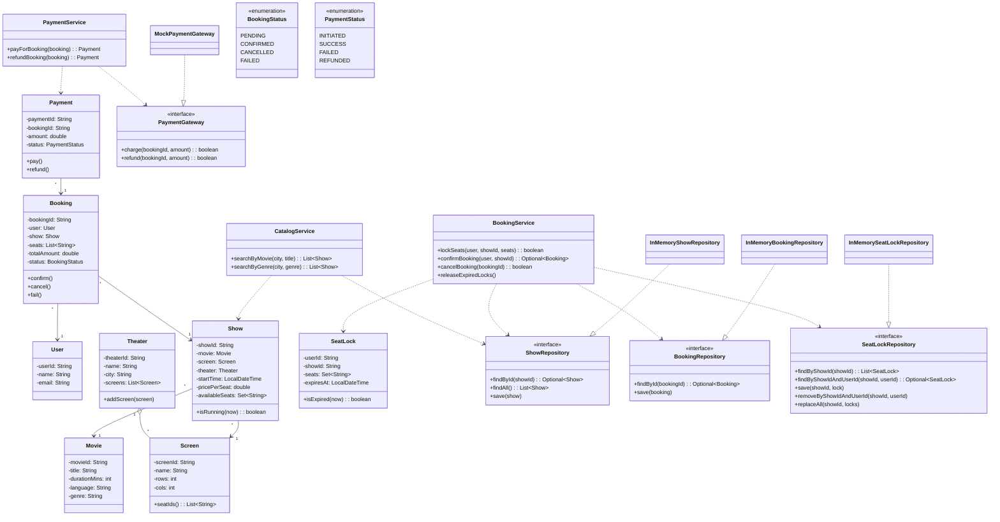

# BookMyShow - Class Diagram

## Notes
- `Show.availableSeats` tracks all unbooked seats.
- `SeatLock` prevents race conditions for concurrent users.
- Booking is a two-step flow: lock seats -> pay -> confirm.
